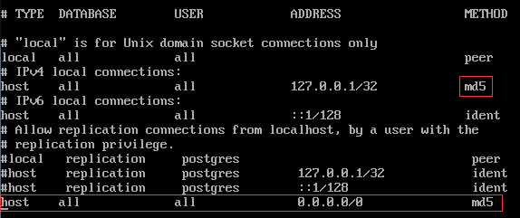

安装环境：CentOS7.2，与[此处](http://www.cnblogs.com/think8848/p/5862469.html)环境相同

在安装之前，先看看官方的[安装说明](https://www.postgresql.org/download/linux/redhat/)总是一个好习惯

CentOS7.2中自带的PostgreSQL是9.2版本的，里面没有NoSQL特性，因此我们使用rpm包安装方式，PostgreSQL的repository包地址列表在[这里](http://yum.postgresql.org/repopackages.php)。

## 1. 首先安装PostgreSQL的rpm

```
sudo yum install http://yum.postgresql.org/9.5/redhat/rhel-7-x86_64/pgdg-redhat95-9.5-2.noarch.rpm -y
```

## 2. 然后再安装PostgreSQL服务器和第三方扩展包

```
sudo yum install postgresql95-server postgresql95-contrib -y
```

## 3. 初始化数据库
默认情况下，Postgresql安装目录是/usr/pgsql-9.5,而Postgresql的数据目录是/var/lib/pgsql/版本号/data目录，如果你从一开始就规划了/var很大磁盘空间，就没有问题，但是一旦你的/var目录空间并不大，那么就要考虑在安装Postgresql时指定安装目录了，在本例中，我们假定/home的空间很大。

首先在/home下创建一个Postgresql的数据目录吗，并分配权限

```
sudo mkdir /home/pgdata
sudo chown postgres:postgres /data/pgdata
sudo chmod 750 /home/pgdata
```

然后设置环境变量

```
export PATH=/usr/pgsql-9.5/bin:$PATH
export LD_LIBRARY_PATH=/usr/pgsql-9.5/lib
export PGDATA=/home/pgdata
```

然后使用命令initdb生成数据库簇,在此之此，请切换至postgres用户

```
initdb
```

最后尝试启动Postgresql服务

```
pg_ctl start -D $PGDATA
```

使用 ps -ef | grep postgres 验证，如果有一堆postgres相关进程，那就安装成功了。

如果这个过程中出现过一个错误，启动失败： lock file "postmaster.pid" already exists
解决办法：将/home/postgresql_data下的postmaster.pid删除再重启服务就好了

打开 sudo vi /usr/lib/systemd/system/postgresql-9.5.service ，在#Location of database direcotry配置节里面没有指定正确的PGDATA。我们需要将下面的PGDATA设置成正确值

```
#Location of database directory
Environment=PGDATA=/home/pgdata
```

## 4. 配置数据库服务开机启动并立即启动数据库服务

```
sudo systemctl enable postgresql-9.5.service
sudo service postgresql-9.5 start
```

## 5. 检查数据库服务状态，有绿色，没红色说明启动OK了

```
service postgresql-9.5 status
```

## 6. 修改postgres用户密码，切换到postgres用户，进入数据库，修改数据库中postgres用户的密码

```
sudo passwd postgres
su postgres
psql
ALTER USER postgres WITH PASSWORD '123';
```

## 7. 设置远程连接，修改/home/pgdata/postgresql.conf

将 #listen_addresses = 'localhost' 前的#号去掉，然后将后面的localhost改为*，
将 #port = 5432 前的#去掉,
再将 #password_encryption = on 前面的#号去掉，如下所示：

```
listen_addresses = '*'
port = 5432
password_encryption = on
```

**在CentOS上，默认的PostgreSQL数据目录是/var/lib/pgsql/版本号/data，我们这里将数据库的数据目录修改为了/home/pgdata/**

## 8. 设置远程连接，修改/home/pgdata/pg_hba.conf

再对pg_hba.conf内容进行配置将上面红框内的ident改为md5,然后再在最下面加入 host all all 0.0.0.0/0 md5 ，如下所示：



## 9. 重启postgresql-9.5服务，使配置文件重效

```
service postgresql-9.5 restart
```

## 10. 开启防火墙5432端口

```
sudo firewall-cmd --zone=public --add-port=5432/tcp --permanent
sudo firewall-cmd --reload
```

## 11. 接下来我们创建一个数据库

```
psql
CREATE DATABASE testdb;
```

我们就创建了一个名为testdb的数据库

## 12.然后再创建一名用户

```
CREATE USER testuser CREATEDB LOGIN PASSWORD '123'
```

这样我们就创建了一个名为testuser的用户，这个用户可以创建数据库，还可以登录，密码是123

## 13. 接下来将testdb的所有权限都分配给think8848同学

```
GRANT ALL ON DATABASE testdb TO testuser
```

## 14. 退出postgres用户登录，命令为\q, 对，你没看错，就是一个反斜杠和一个q

## 15. 尝试用testuser登录数据库

```
psql -U testuser -h 127.0.0.1 -p 5432 -d testdb -W
```

## 16. 其他数据库命令

最后，再说几个psql很常用的命令，
\c,切换数据库，如: \c postgres; 它的作用和mysql的use postgres一样；
\d，此命令是列出当前库下所有的表。
\du，列出当前数据库下的所有用户。
\dt，列出当前数据库下的所有数据表。
\?，帮助

## 17. GUI管理工具pgAdmin4
下载地址在[这里](https://www.pgadmin.org/download/windows4.php) 
