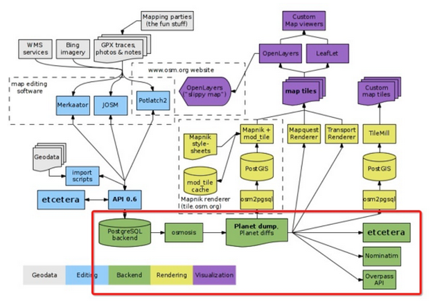

## 1.安装OSM数据导入工具osm2pgsql

### a) windows下：

osm2pgsql下载地址：http://customdebug.com/osm/osm2pgsql.zip

### b) linux下：

```
sudo yum install osm2pgsql
```

### c) 下载default.style文件

https://github.com/openstreetmap/osm2pgsql/blob/master/default.style
将下载的default.style放入到.\osm2pgsql\x64文件夹下。

## 2.下载OSM地图

osm数据格式主要有以下几种，可以通过以下网站下载数据。

osm数据格式：

- **OSM XML** – xml-format provided by the API
- **PBF** – highly compressed, optimized binary format similar to the API
- **o5m** – for high-speed processing, uses PBF coding, has same structure as XML format
- **OSMJSON** – json variant of OSM XML

osm数据下载网站：

- **GeoFabrik：**[**http://www.geofabrik.de/**](http://www.geofabrik.de/?spm=a2c4e.11153940.blogcont16907.5.972ada4biEOaKp)
- **Metro Extracts：**[**http://metro.teczno.com/**](http://metro.teczno.com/?spm=a2c4e.11153940.blogcont16907.6.972ada4biEOaKp)
- **HOT Exports：**[**http://hot.openstreetmap.org/**](http://hot.openstreetmap.org/?spm=a2c4e.11153940.blogcont16907.7.972ada4biEOaKp)
- **BBBike：**[**http://extract.bbbike.org/**](http://extract.bbbike.org/?spm=a2c4e.11153940.blogcont16907.8.972ada4biEOaKp)

OSM地图下载地址：<http://download.geofabrik.de/>
下载较大的中国地图[china](http://download.geofabrik.de/asia/china-latest.osm.pbf)就可以了，也可以下载尺寸较小的台湾地图[taiwan](http://download.geofabrik.de/asia/taiwan-latest.osm.pbf)

## 3. 将OSM数据导入到pgsql

```
#创建存放osm原始数据的目录
mkdir /data/osmdata
cd /data/osmdata

#下载osm数据...
#下载样式文件
wget -O openstreetmap-carto-master.zip https://codeload.github.com/gravitystorm/openstreetmap-carto/zip/master
unzip openstreetmap-carto-master.zip

#修改权限
sudo chown postgres:postgres /data/osmdata

#切换用户
su postgres

#不带样式文件
osm2pgsql -s -U postgres -H 127.0.0.1 -P 5432 -W -d gisdb /data/osmdata/taiwan-latest.osm.pbf

//带样式文件
osm2pgsql -s -U postgres -H 127.0.0.1 -P 5432 -W -d gisdb /data/osmdata/taiwan-latest.osm.pbf --style /data/osmdata/openstreetmap-carto-master/openstreetmap-carto.style
```

注：osm2pgsql导入数据有两种模式， normal and slim mode。
normal mode会在内存中产生如下三张中间表，并在导入结束后丢弃，因此速度较快。

- planet_osm_nodes
- planet_osm_ways
- planet_osm_rels
  而slim mode则将中间结果完全放置到数据库中。slim模式的好处是方便更新。
  两者使用的区别在于是否加“-s”，加了表示slimmode，本文使用slim mode。
  使用slim mode导入数据后在数据库中会产生一系列数据表。

## 4.基于OSM的地图服务架构


## 5.OSM数据结构介绍

OpenStreetMap包括空间数据以及属性数据。其中空间数据主要包括三种：点（Nodes）、路（Ways）和关系（Relations），这三种原始构成了整个地图画面。其中，Nodes定义了空间中点的位置；Ways定义了线或区域；Relations（可选的）定义了元素间的关系。

属性数据Tags用于描述上述矢量数据基元。（[http://wiki.openstreetmap.org/wiki/Elements](http://wiki.openstreetmap.org/wiki/Elements?spm=a2c4e.11153940.blogcont16907.4.972ada4biEOaKp)）

### 2.1. Node 

node通过经纬度定义了一个地理坐标点。同时，还可以height=*标示物体所海拔；通过layer=* 和 level=*，可以标示物体所在的地图层面与所在建筑物内的层数；通过place=* and name=*来表示对象的名称。同时，way也是通过多个点（node）连接成线（面）来构成的。

### 2.2. Way   

通过2-2000个点（nodes）构成了*way。way*可表示如下3种图形事物（非闭合线（**Open polyline** ）、闭合线（**Closed polyline**）、区域（**Area** ））。对于超过2000 nodes的way，可以通过分割来处理。

a）Open polyline 
非闭合线：收尾不闭合的线段。通常可用于表示现实中的道路、河流、铁路等。

b）Closed polyline 
闭合线：收尾相连的线。例如可以表示现实中的环线地铁。

c）Area 
区域：闭合区域。通常使用landuse=* 来标示区域等。 

### 2.3. Relation 

一个*Relation*是用来描述两个或多个基元的相互关系（nodes, ways 或者其他的relations），相互的关系通过*role*来定义，包括：

a）route ：定义公路、自行车道、铁路等

b）多个多边形：定义area例如建筑、河堤等

c）边界：装门用来定义行政边界

d）限制：用于描述限制比如“非左转”

### 2.4. Tag 

标签不是地图基本元素，但是各元素都通过tag来记录数据信息。通过'key' and a 'value'来对数据进行记录（了解xml或者数据库的应该都比较清楚了吧？）。例如，可以通过highway=residential来定义居住区道路；同时，可以使用附加的命名空间来添加附加信息，例如：maxspeed:winter=*就表示冬天的最高限速。
