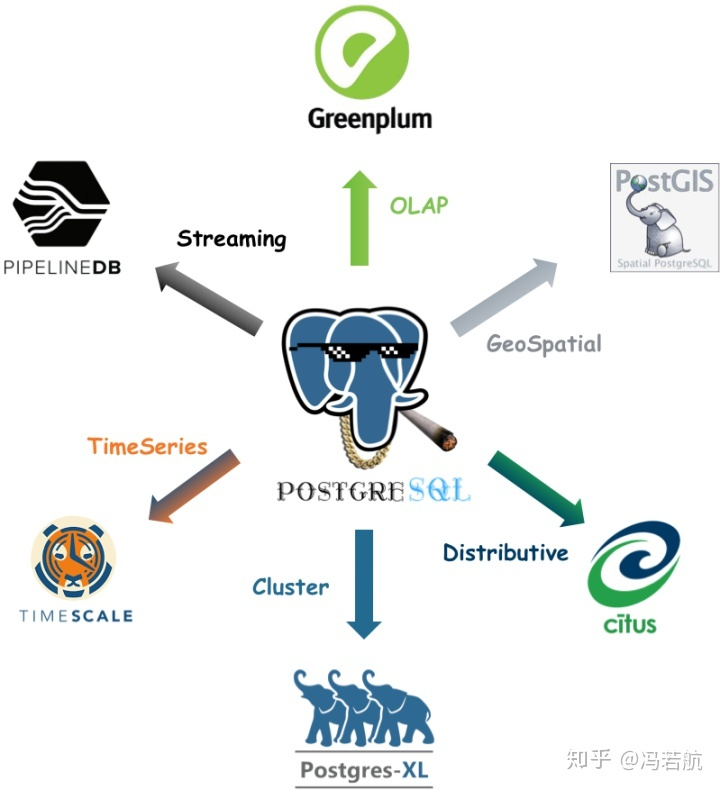
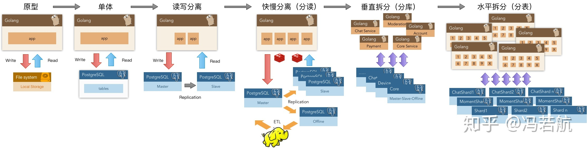

## postgresql不仅仅是sql数据库

1. 它可以存储 array 和 json, 可以在 array 和 json 上建索引, 甚至还能用表达式索引. 为了实现文档数据库的功能, 设计了 jsonb 的存储结构. 有人会说为什么不用 Mongodb 的 BSON 呢? Pg 的开发团队曾经考虑过, 但是他们看到 BSON 把 ["a", "b", "c"] 存成 {0: "a", 1: "b", 2: "c"} 的时候就决定要重新做一个 jsonb 了... 现在 jsonb 的性能已经优于 BSON.

2. 现在往前端偏移的开发环境里, 用 Pg + PostgREST 直接生成后端 API 是非常快速高效的办法。 
   [begriffs/postgrest · GitHub](https://link.zhihu.com/?target=https%3A//github.com/begriffs/postgrest) 。
   postgREST 的性能非常强悍, 一个原因就是 Pg 可以直接组织返回 json 的结果.

3. 它支持服务器端脚本: TCL, Python, R, Perl, Ruby, MRuby ... 自带 map-reduce 了.

4. 它有地理信息处理扩展 (GIS 扩展不仅限于真实世界, 游戏里的地形什么的也可以), 可以用 Pg 搭寻路服务器和地图服务器:
   [PostGIS — Spatial and Geographic Objects for PostgreSQL](https://link.zhihu.com/?target=http%3A//postgis.net/)

5. 它自带全文搜索功能 (不用费劲再装一个 elasticsearch 咯):
   [Full text search in milliseconds with PostgreSQL](https://link.zhihu.com/?target=https%3A//blog.lateral.io/2015/05/full-text-search-in-milliseconds-with-postgresql/) 
   不过一些语言相关的支持还不太完善, 有个 bamboo 插件用调教过的 mecab 做中文分词, 如果要求比较高, 还是自己分了词再存到 tsvector 比较好.

6. 它支持 trigram 索引.
   trigram 索引可以帮助改进全文搜索的结果: [PostgreSQL: Documentation: 9.3: pg_trgm](https://link.zhihu.com/?target=http%3A//www.postgresql.org/docs/9.3/static/pgtrgm.html)
   trigram 还可以实现高效的正则搜索 (原理参考 [https://swtch.com/~rsc/regexp/regexp4.html](https://link.zhihu.com/?target=https%3A//swtch.com/%7Ersc/regexp/regexp4.html) )

7. MySQL 处理树状回复的设计会很复杂, 而且需要写很多代码, 而 Pg 可以高效处理树结构:
   [Scaling Threaded Comments on Django at Disqus](https://link.zhihu.com/?target=http%3A//cramer.io/2010/05/30/scaling-threaded-comments-on-django-at-disqus/)
   [http://www.slideshare.net/quipo/trees-in-the-database-advanced-data-structures](https://link.zhihu.com/?target=http%3A//www.slideshare.net/quipo/trees-in-the-database-advanced-data-structures)

8. 它可以高效处理图结构, 轻松实现 "朋友的朋友的朋友" 这种功能:
   [http://www.slideshare.net/quipo/rdbms-in-the-social-networks-age](https://link.zhihu.com/?target=http%3A//www.slideshare.net/quipo/rdbms-in-the-social-networks-age)

9. 它可以把 70 种外部数据源 (包括 Mysql, Oracle, CSV, hadoop ...) 当成自己数据库中的表来查询:
   [Foreign data wrappers](https://link.zhihu.com/?target=https%3A//wiki.postgresql.org/wiki/FDW%3Fnocache%3D1)

   **心动不如行动**

   [Converting MySQL to PostgreSQL](https://link.zhihu.com/?target=https%3A//en.wikibooks.org/wiki/Converting_MySQL_to_PostgreSQL)

## PostgreSQL是“世界上最先进的开源关系型数据库”

它是一款**一专多长的全栈数据库：在可观的规模内，都能做到一招鲜吃遍天**。

​      成熟的应用可能会用到许许多多的数据组件（功能）：缓存，OLTP，OLAP/批处理/数据仓库，流处理/消息队列，搜索索引，NoSQL/文档数据库，地理数据库，空间数据库，时序数据库，图数据库。传统架构选型可能会组合使用多种组件，典型的如：Redis + MySQL + Greenplum/Hadoop + Kafuka/Flink + ElasticSearch。在这里MySQL只能扮演OLTP关系型数据库的角色，但如果是PostgreSQL，就可以身兼多职，**One hold them all**，比如：

**OLTP**：事务处理是PostgreSQL的本行

**OLAP**：citus分布式插件，ANSI SQL兼容，窗口函数，CTE，CUBE等高级分析功能，任意语言写UDF

**流处理**：PipelineDB扩展，Notify-Listen，物化视图，规则系统，灵活的存储过程与函数编写

**时序数据**：timescaledb时序数据库插件，分区表，BRIN索引

**空间数据**：PostGIS扩展（杀手锏），内建的几何类型支持，GiST索引。

**搜索索引**：全文搜索索引足以应对简单场景；丰富的索引类型，支持函数索引，条件索引

**NoSQL**：JSON，JSONB，XML，HStore原生支持，至NoSQL数据库的外部数据包装器

**数据仓库**：能平滑迁移至同属Pg生态的GreenPlum，DeepGreen，HAWK等，使用FDW进行ETL

**图数据**：递归查询

**缓存**：物化视图

PostgreSQL知名扩展

​     在探探的实践中，整个系统就是围绕PostgreSQL设计的。几百万日活，几百万全局DB-TPS，几百TB数据的量级下，数据组件只用了PostgreSQL。直到接近千万日活，才开始进行架构调整引入独立的数仓，消息队列和缓存。这只是验证过的规模量级，进一步压榨PG是完全可行的。

围绕PostgreSQL的架构演进

​     因此在一个很可观的规模内，PostgreSQL都可以扮演多面手的角色，一个组件当多种组件使。**虽然在某些领域它可能比不上专用组件**，至少都做的都还不赖。**而单一数据组件选型可以极大地削减项目额外复杂度，这意味着能节省很多成本。它让十个人才能搞定的事，变成一个人就能搞定的事。**

​     为了不需要的规模而设计完全是白费功夫，实际上这属于过早优化的一种形式。只有当没有单个软件能满足你的所有需求时，才会存在分拆和集成的利弊权衡。集成多种异构技术是相当棘手的工作，如果真有那么一样技术可以满足你所有的需求，那么使用该技术就是最佳选择，而不应试图去集成多个组件来重新实现它。

​     当业务规模增长到一定量级时，可能最终还是不得不使用基于微服务/总线的架构，将这些功能分拆为多个组件。但PostgreSQL的存在极大地推后了这个权衡到来的阈值，而且在分拆之后依然能继续发挥重要的作用。

当然除了功能强大之外，Pg的另外一个重要的优势就是**运维友好**。有很多非常实用的特性：

- DDL能放入事务中，删表，TRUNCATE，创建函数，索引，都可以放在事务里原子生效，或者回滚。
  这就能进行很多骚操作，比如在一个事务里通过RENAME，完成两张表的王车易位。
- 能够并发地创建或删除索引（不锁表）；为表添加新的空字段不锁表，瞬间完成。
  这意味着可以随时在线上按需添加移除索引，添加字段，不影响业务。
- 复制方式多样：段复制，流复制，触发器复制，逻辑复制，插件复制，多种复制方法。
  丰富的复制支持使得不停服务迁移数据变得无比容易。
- 提交方式多样：异步提交，同步提交，法定人数同步提交。
- FDW的存在让ETL变得无比简单，一行SQL就能解决。
- 系统视图非常完备，做监控系统相当简单。

​      除了运维之外，Pg还有一个巨大的优势就是**协议友好**，类BSD/MIT的协议。君不见多少国产数据库，BAT云数据库都是Pg的换皮或二次开发产品。

​     相比之下，MySQL社区版是GPL协议，要不是GPL传染，怎么这么多基于MySQL改的数据库都开源了。而且MySQL还捏在乌龟壳手里，React改协议的风波算是一个前车之鉴。

当然，要说PG有什么缺点或者遗憾，那还是有几个的，不过也无伤大雅：

- 因为使用了MVCC，数据库需要定期VACUUM，有额外的维护工作。
- 没有`pt-xxx`那么成熟的MySQL工具脚本。
- 没有很好的开源**集群**监控方案，需要自己做。
- 慢查询日志和普通日志是混在一起的，需要自己解析处理。
- 官方Pg没有很好用的列存储，对数据分析而言算一个小遗憾。

还有一个劣势：MySQL确实是**最流行**的开源关系型数据库，所以Pg招人相对困难。很多时候只好自己培养。不过看DB Engines上的流行度趋势，未来还是很光明的。
